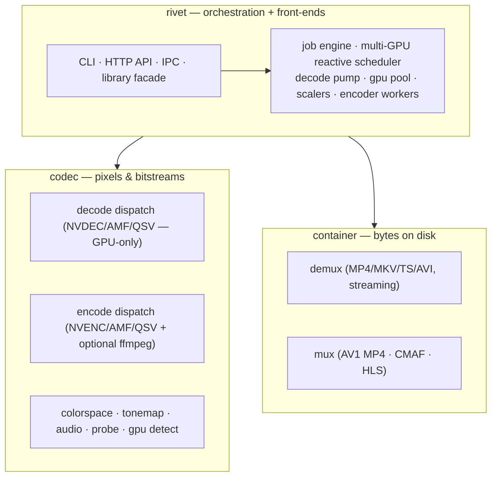
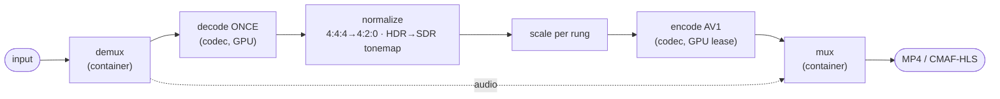
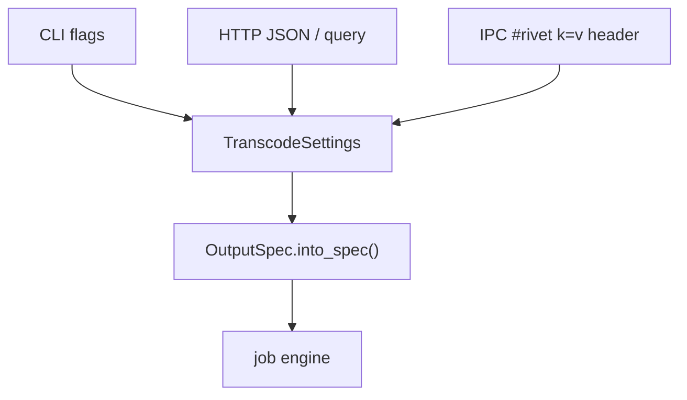

# rivet architecture

This is the **start-here** map of the codebase: what the system is, how the code
is organized, and where to read next. For the per-frame data flow see
[pipeline.md](pipeline.md); for the rationale behind the big choices see
[decisions.md](decisions.md); for the deep per-crate references see the
[documentation map](#documentation-map) at the bottom.

---

## What rivet is

rivet takes an arbitrary input video file and transcodes it to **AV1** — as a
single MP4, a multi-rendition ABR ladder, or a segmented **CMAF/HLS** package —
on the GPU when one is present, falling back to software. It ships three ways to
drive it from one engine:

- a **library** (`rivet::transcode_file`, `rivet::run_job`),
- a **CLI** (`rivet transcode | probe | devices | capabilities | pipe | ipc | serve`),
- an **HTTP API** and a **Unix-socket IPC** server.

The design goals that explain almost every decision in the tree (the full list
is in [decisions.md](decisions.md)):

- **AV1 + Opus + MP4 out by default, royalty-clean.** AV1 is the default output
  video codec (royalty-clean); **H.264 / H.265 are also selectable**
  (`with_video_codec` / `--codec`) for legacy-player compatibility, accepting
  their patent-licensing tradeoff. Audio is AAC/Opus passthrough or transcoded to
  Opus. AV1-default is the load-bearing recommendation — H.264/H.265 are opt-in.
- **No FFmpeg required.** Demuxers, muxers, and the GPU codec dispatch are
  hand-written / hand-rolled `dlopen` FFI in-tree, so a default build has no
  FFmpeg dependency. FFmpeg is an *optional* decode/encode tier behind a feature.
- **Decode once, lease GPUs fairly.** A multi-rendition ladder decodes the source
  a single time and spreads encode work across every GPU.
- **Stream, don't buffer.** Demux yields one sample at a time so a 15-minute
  source doesn't materialize in RAM.

---

## The three crates

| Crate | Responsibility | Reads bytes? | Touches pixels? | Deep-dive |
|-------|----------------|:---:|:---:|-----------|
| [`container`](../crates/container/) | Demux input containers → samples; mux AV1/audio → MP4 / CMAF / HLS. Clean-room, no FFmpeg. | ✅ | ❌ | [container.md](container.md) |
| [`codec`](../crates/codec/) | Decode samples → frames; encode frames → AV1; colorspace, tonemap, audio, GPU detection, probe. Hand-rolled GPU FFI. | ❌ | ✅ | [codec-decode.md](codec-decode.md) · [codec-encode.md](codec-encode.md) |
| [`rivet`](../crates/rivet/) | The configurable job engine, the reactive multi-GPU scheduler, and the CLI / HTTP / IPC front-ends. | — | — | [engine.md](engine.md) |

`container` and `codec` are deliberately generic and depend on nothing rivet-specific — they were extracted so the transcoding core is reusable. `rivet` is the application that wires them into jobs, schedules them across GPUs, and exposes them over three interfaces.

---

## The transcode lifecycle

Every job, whatever the front-end, follows the same shape (the detailed diagram
+ code map is in [pipeline.md](pipeline.md)):

The two things that make this fast are **decode-once fan-out** (one decode feeds
all renditions) and a **GPU lease pool with mid-flight helper dispatch** (a fast
rung's freed GPU picks up a slow rung's work). Both live in the rivet engine —
see [engine.md](engine.md).

---

## The two execution paths

There are two orchestrations, picked by GPU count and output mode:

| Path | When | Code | Notes |
|------|------|------|-------|
| **Single-shot** | one file → one MP4, single GPU / `--single-gpu` | [`transcode.rs`](../crates/rivet/src/transcode.rs) | Straight demux→decode→encode→mux loop; bytes returned in memory. The `pipe`/`ipc` streaming paths use this. |
| **Multi-GPU reactive** | ABR ladders, HLS, or multiple GPUs (default) | [`multigpu.rs`](../crates/rivet/src/multigpu.rs) + the pump/pool/scaler/worker modules | Decode-once pump → per-rung scalers → bounded chunk queues → encoder workers holding GPU leases, with helper dispatch and a cross-vendor `av1C` codec invariant. |

Single-file output on multiple GPUs uses the reactive engine too: it chunks the
one rendition at GOP boundaries, encodes the chunks across the GPUs, and stitches
them back losslessly (`ChunkSeamMode` controls seam quality).

---

## The front-ends share one definition

The CLI flags, the HTTP JSON/query spec, and the IPC `#rivet` header are all thin
adapters over a single canonical knob set,
[`TranscodeSettings`](../crates/rivet/src/settings.rs), with one
`into_spec()` builder. Add an option once there and every front-end gets it — see
[engine.md](engine.md#front-ends) and [output-spec.md](output-spec.md).

---

## Documentation map

| Doc | What it covers |
|-----|----------------|
| **architecture.md** (this) | The system map, the crates, the lifecycle, where to read next. |
| [pipeline.md](pipeline.md) | The end-to-end data flow with diagrams + a code map. |
| [decisions.md](decisions.md) | The cross-cutting **why** — the load-bearing design decisions and their rationale. |
| [codec-decode.md](codec-decode.md) | The `codec` crate's decode side: the dispatch tiers, each GPU decoder, GPU detection, bitstream parsers, probe, HDR/SEI. |
| [codec-encode.md](codec-encode.md) | The `codec` crate's encode side: the encoder dispatch, each HW backend, quality tuning, colorspace, tonemapping, audio. |
| [container.md](container.md) | The `container` crate: demuxers (streaming + per-format), Annex-B conversion, the AV1 MP4 muxer, CMAF/HLS, audio glue. |
| [engine.md](engine.md) | The `rivet` crate internals: the job engine, the reactive multi-GPU scheduler, progress, and the CLI/HTTP/IPC front-ends. |
| [output-spec.md](output-spec.md) | The complete `OutputSpec` configuration guide (every knob, with examples). |
| [cli.md](cli.md) | The CLI reference — every subcommand, flag, and env var. |
| [api.md](api.md) | The HTTP API reference — endpoints, request bodies, job lifecycle, OpenAPI. |

Source-tree conventions to know while reading: GPU backends are hand-rolled
`dlopen` FFI (no wrapper crates) and ship with `*_stub.rs` fallbacks so a build
without that vendor's feature still compiles; a vendored scaffold that a real
library later replaced is **deleted**, not kept "for reference."
