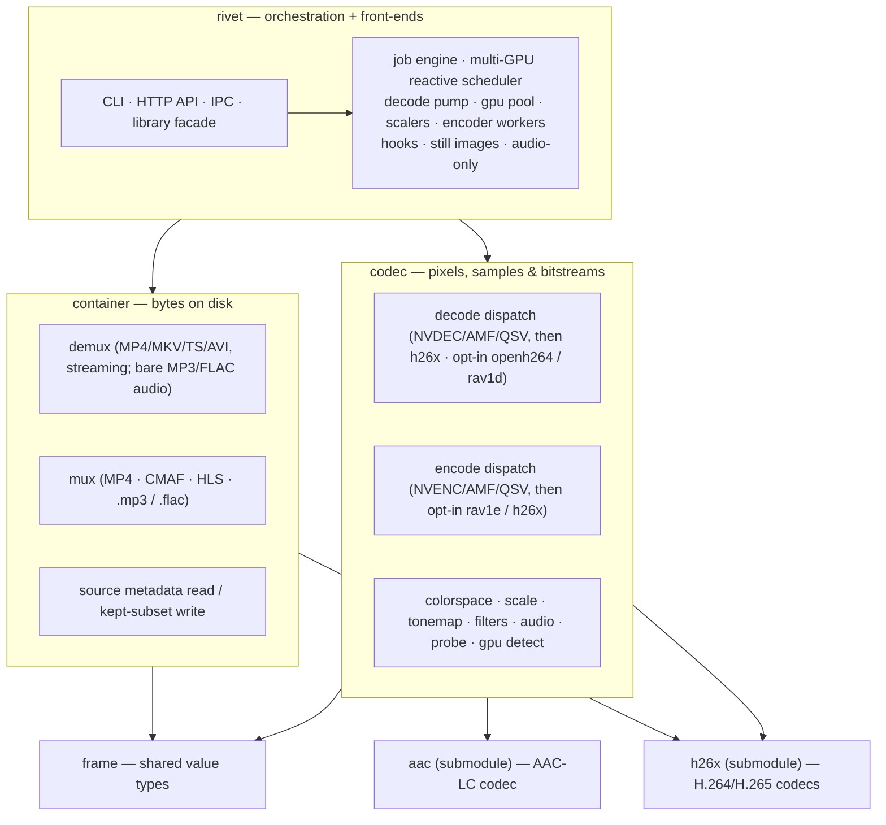
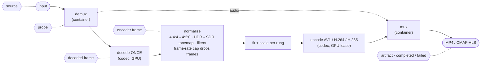
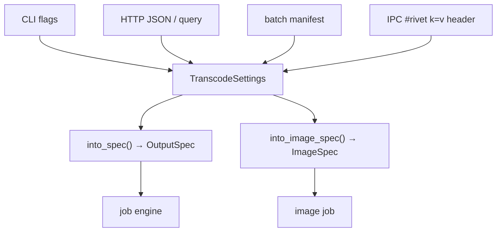

# rivet architecture

This is the **start-here** map of the codebase: what the system is, how the code
is organized, and where to read next. For the per-frame data flow see
[pipeline.md](pipeline.md); for the rationale behind the big choices see
[decisions.md](decisions.md); for the deep per-crate references see the
[documentation map](#documentation-map) at the bottom.

---

## What rivet is

rivet takes an arbitrary input video file and transcodes it — to **AV1** by
default, **H.264 / H.265** on request — as a single MP4, a multi-rendition ABR
ladder, or a segmented **CMAF/HLS** package, on the GPU when one is present,
falling back to software. The same engine writes **audio-only** files (`.mp3`,
`.flac`, `.m4a`) and, with the `image` feature, **still images** (AVIF / WebP /
JPEG / PNG, of a picture or taken from a video). It ships three ways to drive it
from one engine:

- a **library** (`rivet::transcode_file`, `rivet::run_job`,
  `rivet::run_splice_job`, and `rivet::image::run_image_job` with `image`),
- a **CLI** (`rivet transcode | splice | image | probe | devices | capabilities |
  pipe | ipc | batch | serve`; `image`, `ipc` and `batch` need the feature of
  the same name, `serve` the `server` feature),
- an **HTTP API** and a **Unix-socket IPC** server.

Every job can run caller-supplied **hooks** at fixed points (the source, the
probe, decoded and encoder frames, stills, each output, completion and
failure) — see [hooks.md](hooks.md).

The design goals that explain almost every decision in the tree (the full list
is in [decisions.md](decisions.md)):

- **AV1 + Opus + MP4 out by default, royalty-clean.** AV1 is the default output
  video codec (royalty-clean); **H.264 / H.265 are also selectable**
  (`with_video_codec` / `--codec`) for legacy-player compatibility, accepting
  their patent-licensing tradeoff. By default audio is passed through when the
  output carries it (AAC, Opus, AC-3, E-AC-3, DTS; MP3 into a single-file MP4)
  and transcoded to Opus otherwise; AAC-LC, MP3, FLAC and ALAC output are
  opt-in (`--audio`). AV1-default is the load-bearing recommendation —
  H.264/H.265 are opt-in.
- **No FFmpeg, in any build.** Demuxers, muxers, and the GPU codec
  dispatch are hand-written / hand-rolled `dlopen` FFI in-tree; the software
  H.264/H.265 codecs are the workspace's own `h26x` crate, the AAC codec its
  own `aac` crate, and the software AV1 paths are pure Rust (rav1e / rav1d).
  There is no feature that adds libavcodec; the opt-in decode tier that did
  was removed on 2026-10-02 (see
  [`crates/codec/Cargo.toml`](../crates/codec/Cargo.toml)). See also
  [No FFmpeg](../README.md#no-ffmpeg).
- **Decode once, lease GPUs fairly.** A multi-rendition ladder decodes the source
  a single time and spreads encode work across every GPU.
- **Stream, don't buffer.** Demux yields one sample at a time so a 15-minute
  source doesn't materialize in RAM.

---

## The crates

The workspace is six crates (plus the `examples/yolo` example crate). Three
carry the transcoder; three underneath them hold shared types and the codecs
written in Rust here, two of them git submodules.

```mermaid
flowchart TD
    subgraph rivet["rivet — orchestration + front-ends"]
        FE["CLI · HTTP API · IPC · library facade"]
        ENG["job engine · multi-GPU reactive scheduler<br/>decode pump · gpu pool · scalers · encoder workers<br/>hooks · still images · audio-only"]
        FE --> ENG
    end
    rivet --> codec
    rivet --> container
    subgraph codec["codec — pixels, samples & bitstreams"]
        DEC["decode dispatch (NVDEC/AMF/QSV, then h26x · opt-in openh264 / rav1d)"]
        ENC["encode dispatch (NVENC/AMF/QSV, then opt-in rav1e / h26x)"]
        CLR["colorspace · scale · tonemap · filters · audio · probe · gpu detect"]
    end
    subgraph container["container — bytes on disk"]
        DMX["demux (MP4/MKV/TS/AVI, streaming; bare MP3/FLAC audio)"]
        MUX["mux (MP4 · CMAF · HLS · .mp3 / .flac)"]
        META["source metadata read / kept-subset write"]
    end
    codec --> frame
    codec --> h26x
    codec --> aac
    container --> frame
    container --> h26x
    frame["frame — shared value types"]
    h26x["h26x (submodule) — H.264/H.265 codecs"]
    aac["aac (submodule) — AAC-LC codec"]
```

| Crate | Responsibility | Reads bytes? | Touches pixels? | Deep-dive |
|-------|----------------|:---:|:---:|-----------|
| [`container`](../crates/container/) | Demux input containers → samples; mux video/audio → MP4 / CMAF / HLS and bare `.mp3` / `.flac`; read a source's identifying metadata and write a kept subset. Clean-room, no FFmpeg. | ✅ | ❌ | [container.md](container.md) |
| [`codec`](../crates/codec/) | Decode samples → frames; encode frames → AV1 / H.264 / H.265; colorspace, scaling, tonemap, video filters, audio decode/encode, GPU detection, probe. Hand-rolled GPU FFI. | ❌ | ✅ | [codec-decode.md](codec-decode.md) · [codec-encode.md](codec-encode.md) |
| [`rivet`](../crates/rivet/) | The configurable job engine, the reactive multi-GPU scheduler, hooks, the still-image path, and the CLI / HTTP / IPC front-ends. | — | — | [engine.md](engine.md) |
| [`frame`](../crates/frame/) | The value types `codec` and `container` share (`StreamInfo`, `VideoFrame`, colour metadata, `EncodedPacket`) and bitstream introspection. Depends on nothing but `bytes`; builds for wasm32. `codec` re-exports it at `codec::frame`. | — | — | [README](../crates/frame/README.md) |
| [`h26x`](../crates/h26x/) | Git submodule: native H.264 / H.265 decoders and encoders, and the SPS parsers the demuxers use. | — | ✅ | — |
| [`aac`](../crates/aac/) | Git submodule: the AAC-LC encoder and decoder. | — | ✅ | — |

`container` and `codec` are deliberately generic and depend on nothing rivet-specific — they were extracted so the transcoding core is reusable. `container` no longer depends on `codec` at all (only on `frame` and `h26x`), which is what lets it build for wasm32. `rivet` is the application that wires them into jobs, schedules them across GPUs, and exposes them over three interfaces.

---

## The transcode lifecycle

Every video job, whatever the front-end, follows the same shape (the detailed
diagram + code map is in [pipeline.md](pipeline.md)). The dotted boxes are the
[hook](hooks.md) points, where caller-supplied code sees what exists there and
may reject the job:

```mermaid
flowchart LR
    IN([input]) --> D["demux<br/>(container)"]
    D --> DEC["decode ONCE<br/>(codec, GPU)"]
    DEC --> N["normalize<br/>4:4:4→4:2:0 · HDR→SDR tonemap · filters<br/>frame-rate cap drops frames"]
    N --> S["fit + scale per rung"]
    S --> E["encode AV1 / H.264 / H.265<br/>(codec, GPU lease)"]
    E --> M["mux<br/>(container)"]
    M --> OUT([MP4 / CMAF-HLS])
    D -. audio .-> M
    HS{{source}} -.- IN
    HP{{probe}} -.- D
    HD{{decoded frame}} -.- DEC
    HE{{encoder frame}} -.- N
    HA{{artifact · completed / failed}} -.- OUT
```

Two jobs take shorter paths. An **audio-only** job (`mode=audio`, or a
single-file job whose input has no video) demuxes the audio track and runs the
same audio preparation without any video stage. An **image** job
(`mode=image`, the `image` feature, run by `rivet::image::run_image_job`
rather than `run_job`) decodes a still — or takes stills from a video through
the thumbnail capture path, not the decode pump — fits it to each rendition,
and encodes AVIF / WebP / JPEG / PNG; it has a *still* hook point instead of
the frame ones.

The two things that make this fast are **decode-once fan-out** (one decode —
split across the cards at segment-aligned keyframes — feeds all renditions) and
**ladder workers on a GPU lease pool** (every card serves every rung, taking the
next chunk of whichever is furthest behind, so no card idles while work exists).
Both live in the rivet engine — see [engine.md](engine.md).

---

## The execution paths

There are three orchestrations of a video transcode, picked by entry point,
output mode, encode policy and GPU count:

| Path | When | Code | Notes |
|------|------|------|-------|
| **One-shot facade** | `transcode_file` / `transcode_bytes`, and `pipe` / `ipc` with no settings | [`transcode.rs`](../crates/rivet/src/transcode.rs) | Straight demux→decode→normalize→encode→mux loop at the source size; bytes returned in memory. No spec, no rungs, no hooks; frames normalized by the same `FrameNormalizer` the pump uses. |
| **Serial single-file** | single-file output on one card (`--encode single` / `gpu:N`), one capable GPU, an unknown frame count, a trim, or a splice | [`job/run.rs`](../crates/rivet/src/job/run.rs) (`run_serial_single_file`) | One decode pump fans frames to one encoder per rung; each rung muxes its own MP4. Seam-free by construction. |
| **Multi-GPU ladder** | HLS (always), and single-file when the policy spreads, the frame count is known and more than one card can encode | [`multigpu/`](../crates/rivet/src/multigpu/) + the pump/pool/scaler/worker modules | Decode-once pump (one per range when the source splits) → per-rung scalers → bounded chunk queues → one ladder worker per lease serving every rung deepest-first, with a cross-vendor codec invariant. On a host with no usable encode silicon and a software encoder in the build, the leases are software slots. |

Single-file output on the multi-GPU path chunks each rendition at GOP
boundaries, encodes the chunks across the GPUs, and stitches them back
losslessly (`ChunkSeamMode` controls seam quality).

---

## The front-ends share one definition

The CLI flags, the HTTP JSON/query spec, the batch manifest, and the IPC
`#rivet` header are all thin adapters over a single canonical knob set,
[`TranscodeSettings`](../crates/rivet/src/settings.rs), with one spec builder:
`into_spec` (`into_spec_for` against a probed source, which turns a video-less
input into its audio-only form), and `into_image_spec` for `mode=image`. Add an
option once there and every front-end gets it — see
[engine.md](engine.md#the-front-ends-and-the-shared-transcodesettings) and
[output-spec.md](output-spec.md).

```mermaid
flowchart TD
    CLI["CLI flags"] --> TS[TranscodeSettings]
    JSON["HTTP JSON / query"] --> TS
    YAML["batch manifest"] --> TS
    KV["IPC #rivet k=v header"] --> TS
    TS --> SPEC["into_spec() → OutputSpec"] --> ENG["job engine"]
    TS --> ISPEC["into_image_spec() → ImageSpec"] --> IMG["image job"]
```

---

## Documentation map

| Doc | What it covers |
|-----|----------------|
| **architecture.md** (this) | The system map, the crates, the lifecycle, where to read next. |
| [pipeline.md](pipeline.md) | The end-to-end data flow with diagrams + a code map. |
| [decisions.md](decisions.md) | The cross-cutting **why** — the load-bearing design decisions and their rationale. |
| [codec-decode.md](codec-decode.md) | The `codec` crate's decode side: the dispatch tiers, each GPU decoder, GPU detection, bitstream parsers, probe, HDR/SEI. |
| [codec-encode.md](codec-encode.md) | The `codec` crate's encode side: the encoder dispatch, each HW backend, quality tuning, colorspace, tonemapping, audio. |
| [container.md](container.md) | The `container` crate: demuxers (streaming + per-format), Annex-B conversion, the AV1 MP4 muxer, CMAF/HLS, audio glue. |
| [engine.md](engine.md) | The `rivet` crate internals: the job engine, the reactive multi-GPU scheduler, progress, hooks, the still-image and audio-only paths, and the CLI/HTTP/IPC front-ends. |
| [output-spec.md](output-spec.md) | The complete `OutputSpec` configuration guide (every knob, with examples). |
| [cli.md](cli.md) | The CLI reference — every subcommand, flag, and env var. |
| [hooks.md](hooks.md) | Hooks: a specific kind for each integration point of a job, and their reports. |
| [batch.md](batch.md) | The batch manifest DSL (`rivet batch`). |
| [api.md](api.md) | The HTTP API reference — endpoints, request bodies, job lifecycle, OpenAPI. |

Source-tree conventions to know while reading: GPU backends are hand-rolled
`dlopen` FFI (no wrapper crates); the encode backends ship with `*_stub.rs`
fallbacks and the decode backends are `cfg`-gated, so a build without that
vendor's feature still compiles; a vendored scaffold that a real
library later replaced is **deleted**, not kept "for reference."
