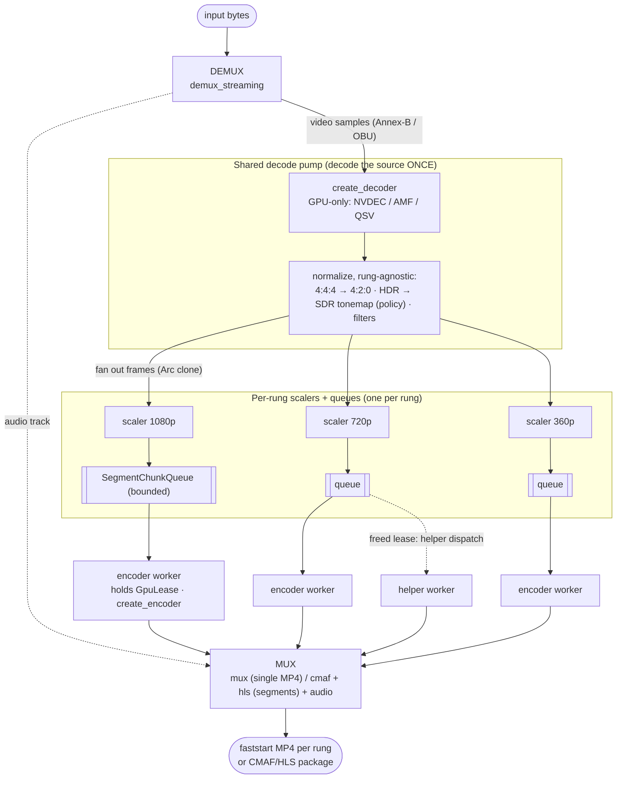
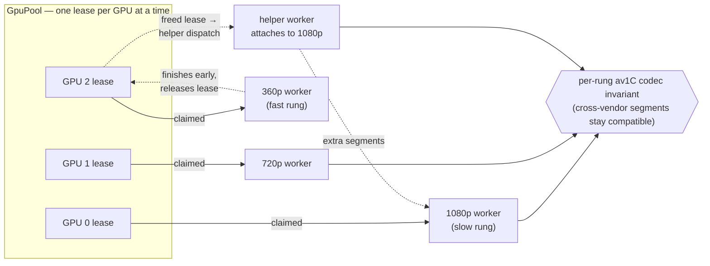

# rivet pipeline & architecture

How an input file becomes AV1 output, end to end — the crates, the data flow,
and where each piece lives. For the user-facing knobs see the
[CLI reference](cli.md) and [HTTP API reference](api.md); this document is the
"how it works" companion.

---

## Crate map

rivet is three crates. The generic transcoding crates were extracted so they can
be reused (and a standalone `rivet` CLI/server built on top).

| Crate | Role | Key modules |
|-------|------|-------------|
| **`container`** | Demux (in) + mux (out). Clean-room, no FFmpeg. | `streaming` (MP4/MKV/TS/AVI streaming demuxers), `mux` (faststart AV1 MP4), `cmaf` (fragmented-MP4 segments), `hls` (playlists), `annexb` (AVCC→Annex-B) |
| **`codec`** | Frame types, GPU decode/encode dispatch, colorspace, probe. | `decode` (NVDEC/AMF/QSV — GPU-only), `encode` (NVENC/AMF/QSV + optional ffmpeg), `colorspace` + `tonemap`, `gpu` (detection), `frame` |
| **`rivet`** | The job engine + the multi-GPU reactive scheduler + the CLI/server. | `job`, `decode_pump`, `multigpu`, `gpu_pool`, `rung_scaler`, `frame_queue`, `encoder_worker`, `spec`, `ladder`, `progress` |

The hardware GPU paths in `codec` are all hand-rolled `dlopen` FFI in-tree (no
external wrapper crate); they build on Windows + Linux. See the
[README's compatibility matrix](../README.md#compatibility-matrix).

---

## End-to-end flow

The entry point is [`rivet::run_job`](../crates/rivet/src/job.rs) (async) /
`run_job_blocking`, or the one-shot `rivet::transcode_file`. `run_job` demuxes,
spins up the shared decode pump, fans out to per-rung work, and assembles the
requested [`OutputMode`](../crates/rivet/src/spec.rs).

---

## 1. Demux

`container::streaming::demux_streaming` dispatches on the container's magic bytes
to a per-format **streaming** demuxer (MP4/MOV, MKV/WebM, MPEG-TS, AVI incl.
OpenDML >1 GiB). Streaming = it yields one video sample at a time rather than
materialising the whole file, so peak RSS stays low. It returns a `StreamInfo`
header (codec string, width/height, frame rate, color metadata, source pixel
format) plus the audio track, and an iterator of video samples already in the
decoder-native bitstream form (Annex-B for H.264/HEVC, OBU for AV1).

## 2. Decode once — the shared pump

[`crate::decode_pump`](../crates/rivet/src/decode_pump.rs) is the heart of the
"rung benefit." **One pump per job, not per rung:** it decodes the source a
single time, runs the *rung-agnostic* per-frame work, and fans the normalized
frame out to N per-rung channels via a cheap `VideoFrame::clone()` (the pixel
`Bytes` are `Arc`-backed, so the clone is a refcount bump, not a copy).

A 5-rung ABR ladder therefore decodes the input **once, not five times** (the
naïve `ffmpeg`-per-rung approach decodes N times). The cost is backpressure: the
slowest rung (usually the largest, whose encoder is slowest) throttles the pump.

### GPU decode dispatch

`codec::decode::create_decoder` is **GPU-only** — it picks a hardware decoder
for the detected GPU + codec, in vendor order, and **hard-fails** if none
matches (CPU decoders were removed per the GPU-only directive):

1. **NVDEC** (`nvidia`) — hand-rolled CUVID; H.264/HEVC/AV1/VP8/VP9/MPEG-2/MPEG-4,
   10-bit P016. Skippable with `DISABLE_NVDEC` / `DISABLE_NVDEC_<CODEC>`.
2. **AMF** (`amd`) — hand-rolled AMF decode; H.264/HEVC/AV1/VP9.
3. **QSV** (`qsv`) — hand-rolled oneVPL 2.x decode (internal-allocation +
   `FrameInterface::Map`); H.264/HEVC/AV1/VP9, 10-bit P010.

Each backend implements the same `Decoder` trait (`push_sample` → `decode_next`).
A `FfmpegDecoder` exists in `decode/ffmpeg.rs` but is **not** wired into the
factory (only its own tests construct it) — decode is hardware-only as built.
See [codec-decode.md](codec-decode.md#the-decode-dispatch--tiers).

### Rung-agnostic normalization

Done once in the pump, before fanout, because it's identical for every rung:
- **4:4:4 / 4:2:2 → 4:2:0** chroma downsample (AV1 here is always 4:2:0).
- **HDR → SDR tonemap** — *only* when the [`ColorPolicy`](color--bit-depth)
  says so. The default `TonemapToSdr` maps PQ/HLG BT.2020 down to 8-bit BT.709
  (`codec::tonemap` + `colorspace::convert_to_sdr_bt709`); `Passthrough`/`Hdr10`/
  `Hlg` keep it. The pump never tonemaps on its own — it's policy-driven.
- **Video filters** — the spec's [filter chain](filters.md) (crop / pad / flip /
  rotate / grayscale), applied last so every rung sees the transformed source.

## 3. Per-rung scale → chunk

[`crate::rung_scaler`](../crates/rivet/src/rung_scaler.rs): one scaler per rung
sits between the shared pump and that rung's encoder workers. It does the bilinear
scale to the rung's dimensions (CPU, AVX2 where it pays off) and groups K frames
(`K = keyframe_interval` = one CMAF segment's worth) into a `SegmentChunk` with a
monotonic segment index, pushing them into the rung's
[`SegmentChunkQueue`](../crates/rivet/src/frame_queue.rs) (bounded — the pump
blocks when full, workers block when empty). On pump close the scaler flushes the
final partial segment and closes the queue so workers drain cleanly.

## 4. The multi-GPU lease engine — the rung benefit

[`crate::multigpu`](../crates/rivet/src/multigpu.rs) schedules every rung's
segments across **all** detected GPUs:

- **One encoder per GPU at a time.** [`GpuPool`](../crates/rivet/src/gpu_pool.rs)
  hands out a `GpuLease` per slot; an encoder worker holds it for its lifetime.
  This is load-bearing — concurrent NVENC sessions on one CUDA context were found
  to deadlock at ~session 5/5 init (2026-05-02), so the pool enforces
  one-encoder-per-GPU while still running encoders in parallel *across* GPUs.
- **Mid-flight helper dispatch.** When a fast rung releases its lease early, the
  helper dispatcher grabs the freed lease and attaches an extra
  [`encoder_worker`](../crates/rivet/src/encoder_worker.rs) to a still-busy rung.
  Segment work is the unit of parallelism, so a slow rung finishes sooner and
  throughput scales close to linearly with GPU count.
- **Cross-vendor codec invariant.** A helper may land on a different GPU *vendor*
  than the rung's first worker. The per-rung AV1 `RungCodecInvariant` guarantees
  every contributed segment shares the same `av1C` contract, so an NVENC + QSV
  mix on one rendition still decodes cleanly.

Each worker pops a chunk, encodes its K frames with its encoder, and writes one
CMAF segment (a fresh `CmafVideoMuxer` per segment, configured with the segment
index + base decode time so filenames and `tfdt` match a single-encoder
pipeline). Workers exit when the queue returns `None`.

### Encode dispatch

`codec::encode::select_encoder` tries, in order: a **FFmpeg** AV1 encoder first
*if* the `ffmpeg` feature is built and `DISABLE_FFMPEG` isn't set (libavcodec's
av1_nvenc/av1_qsv/libsvtav1/libaom probe chain — one interface over every vendor
**and** the only software-encode path), then the hand-rolled **NVENC** (`nvidia`,
Ada+) / **AMF** (`amd`, RDNA3+) / **QSV** (`qsv`, Arc / Meteor Lake+) backends —
either pinned to the lease's vendor or NVIDIA-first. AV1 only, 4:2:0, 8- or
10-bit. There is **no native rav1e CPU fallback** (removed per the GPU-only
directive): on a default build, if no AV1-encode hardware is present, encoder
construction is a hard error. `build_output_caps()` is the runtime capability
query `OutputSpec::validate` consults; `TRANSCODE_ENCODER_BACKEND=nvenc|amf|qsv`
forces a backend. See [codec-encode.md](codec-encode.md).

## 5. Output modes

[`OutputMode`](../crates/rivet/src/spec.rs) selects the shape:

- **`SingleFile`** — one self-contained faststart MP4 per rung (AV1 + audio).
  - With **one GPU** / `SingleGpu` / `--gpu`: a single encoder for the whole rung
    ([`crate::transcode`](../crates/rivet/src/transcode.rs), the one-shot path).
  - With **multiple GPUs** (default `AllGpus`): the same `multigpu` engine
    chunk-encodes the one rendition at GOP boundaries across the GPUs and
    **stitches** the AV1 packets back into one MP4. Each chunk is an independent
    IDR-led GOP so the result always plays. `ChunkSeamMode` controls quality
    across the ~2 s seams — `Parallel` (fastest, NVENC chunks run VBR so seams
    can step), `ParallelConstQp` (constant-QP, seam-flat, quality still tracks the
    target), or `Serial` (one encoder, seam-free). See
    [CLI `--seam-mode`](cli.md#chunk-seams---seam-mode).
- **`Hls`** — a CMAF/HLS package: `master.m3u8`, a shared audio rendition group,
  and `video/<height>p/{init.mp4, seg-*.m4s, playlist.m3u8}` per rung,
  **segment-aligned across the ladder** so hls.js does ABR cleanly. The `multigpu`
  orchestrator schedules every rung's segments across all GPUs, then `job`
  assembles the package (audio rendition + playlists via `container::hls`).

## 6. Color & bit depth

Two orthogonal axes on `OutputSpec`, with presets that bundle both:

| Axis | Type | Builder | Presets |
|------|------|---------|---------|
| Color (gamut + SDR/HDR transfer) | `ColorPolicy` | `with_color` | `.web_sdr()` (default) · `.hdr10()` · `.hlg()` · `.passthrough()` |
| Bit depth (bits per sample) | `BitDepth` | `with_bit_depth` | (HDR presets imply 10-bit) |

**Why two methods, not four?** The color knobs are exactly `with_color(ColorPolicy)`
and `with_bit_depth(BitDepth)` — there is *no* separate `with_gamut` /
`with_transfer` / `with_color_space`. `ColorPolicy` deliberately **bundles** two
things:

- **Gamut** — the color *primaries*, i.e. which colors are representable.
  **BT.709** (standard SDR) or **BT.2020** (wide, for HDR).
- **Transfer** — the *transfer function* (a.k.a. transfer characteristics /
  EOTF): the curve that maps stored pixel values ↔ actual light. SDR uses a
  gamma curve (~2.2/2.4); HDR uses **PQ** (SMPTE ST 2084, absolute brightness, up
  to 10k nits — HDR10) or **HLG** (ARIB STD-B67, relative — broadcast).

They're bundled because only a few (gamut, transfer, depth) combinations are
web-safe — BT.709+gamma+8-bit (SDR), BT.2020+PQ+10-bit (HDR10),
BT.2020+HLG+10-bit (HLG). Independent gamut/transfer setters would let you spell
nonsense (BT.709+PQ, wide-gamut SDR-gamma, …); the policy makes only the valid
combos expressible, and the presets (`.web_sdr()` / `.hdr10()` / `.hlg()`) name
the intent. Bit depth is the one genuinely orthogonal axis, so it gets its own
method.

`resolve_output(source_color, source_format)` collapses these against the source
into the concrete `(ColorMetadata, PixelFormat)` the encoder gets: `Hdr10`/`Hlg`
force BT.2020 + PQ/HLG and 10-bit (`yuv420p10le`); `BitDepth::Auto` derives depth
from the policy. `validate()` rejects incoherent combos (e.g. HDR with no 10-bit
encoder in the build). Full reference (every method + the color table):
[Configuring a transcode](output-spec.md#4-color--bit-depth).

## 7. Audio

Handled per source codec, interleaved into the output container:
- **Passthrough** (no re-encode): AAC, Opus, AC-3, E-AC-3.
- **Transcode to Opus**: MP3, Vorbis (royalty-clean, Apple-playable in MP4).
- **Drop** (video-only, with a warn): everything else.

`AudioPolicy::ForceOpus` always produces Opus; `Drop` removes audio.

## 8. Progress & the job engine

[`run_job`](../crates/rivet/src/job.rs) streams a uniform
[`RungProgress`](../crates/rivet/src/progress.rs) per rung through a
[`ProgressSink`](../crates/rivet/src/progress.rs) — status (`Pending` → `Running`
→ `Completed`/`Failed`), percent, frames, segments, bytes. Wire it to a closure
(`fn_sink`), a Tokio mpsc channel (`channel_sink`), or your own impl. The same
events back the CLI's progress bars and the HTTP API's job-status polling.

---

## Where to look in the code

| You want to understand… | Start here |
|-------------------------|------------|
| The whole job flow | `crates/rivet/src/job.rs` (`run_job`) |
| Decode-once + fanout | `crates/rivet/src/decode_pump.rs` |
| GPU decode/encode dispatch | `crates/codec/src/decode/mod.rs`, `crates/codec/src/encode/mod.rs` |
| Multi-GPU scheduling | `crates/rivet/src/multigpu.rs` + `gpu_pool.rs` + `frame_queue.rs` + `rung_scaler.rs` + `encoder_worker.rs` |
| Single-file one-shot | `crates/rivet/src/transcode.rs` |
| Output spec / presets | `crates/rivet/src/spec.rs` |
| Demuxers / muxers | `crates/container/src/` |
| Color / tonemap | `crates/codec/src/colorspace.rs`, `crates/codec/src/tonemap.rs` |
